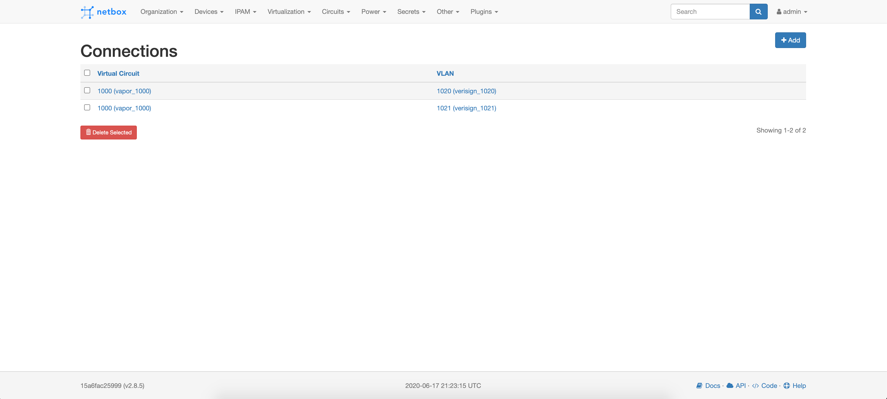

# NetBox Virtual Circuit Plugin

A plugin for [NetBox](https://github.com/netbox-community/netbox) that supports
Virtual Circuit management.

## Definitions

A Virtual Circuit is a circuit created by routing two or more VLANs together.

Each Virtual Circuit is identified by a name, a numeric ID (0-32767), along with
a context. Each Virtual Circuit must be assigned one of the following operational
statuses:
- Pending Configuration
- Configured
- Pending Deletion
- Configuration Error

When a VLAN is assigned to a Virtual Circuit, it can not exist in another Virtual
Circuit without first being removed.

## Installing

Since the plugin is published on
[PyPI](https://pypi.org/project/netbox-virtual-circuit-plugin/), simply issue:
```python
pip install netbox-virtual-circuit-plugin
```
to download and install it.

To enable to plugin, add the plugin's name to the `PLUGINS` list in
`configuration.py` like so:
```python
PLUGINS = ['netbox_virtual_circuit_plugin'] # Note that the name here use underscore, not hyphen.
```

Don't forget to restart NetBox to load the new plugin.

You might also have to manually run the database migrations for Netbox to create the appropriate tables for virtual circuits.
```bash
python3 manage.py migrate
```

For more information about installing plugins, refer to [NetBox's documentation.](https://netbox.readthedocs.io/en/stable/plugins/)

## Compatibility

Below is a table describing the compatibility of various NetBox versions with NetBox Virtual Circuit Plugin versions.

|                   | Netbox 2.8 | NetBox 2.9 | Netbox 2.10 |
| ----------------- | ---------- | ---------- | ----------- |
| `1.0.x`           | ✓          | ✗          | ✗           |
| `1.1.x` to `1.5.x`| ✗          | ✓          | ✗           |
| `1.6.x` and above | ✗          | ✗          | ✓           |

## Using

Once the plugin is installed correctly as instructed above, one can find the
**Virtual Circuit** section under **Plugins** navigation tab via NetBox UI
that is ready to use with correct *admin* permission.

As for REST API use cases, the 2 group endpoints are exposed at:
- `/api/plugins/virtual-circuit/virtual-circuits`
- `/api/plugins/virtual-circuit/vlans`

While the former one is for creating/retrieving/modifying/deleting Virtual
Circuits, the later one is for assigning and managing Virtual-Circuit-to-VLAN
connections. For more information, refer to `/api/docs` as it also conforms
to Swagger Specification for hosted visual documentations.

## Developing

Plugins are essentially self-contained Django apps which integrate with NetBox
to provide custom functionality. For more information, see [NetBox
documentation](https://netbox.readthedocs.io/en/stable/plugins/development/).

To help setup the development environment, it comes with a CLI helper
based on `Makefile`, including the following commands:
```
changelog        Generate a changelog file from GitHub Issue Tracker
clean            Clean up build artifacts
deploy           Run a local development deployment of the plugin with NetBox
docker           Build a local docker image
github-tag       Create and push a tag with the current version
help             Print usage information
migrate          Run makemigrations in Django and produce a migration file locally
release          Package and distribute the current release to PyPI
test             Run unit tests
version          Print the version
```

That said, one can simply build and run a local development image of the plugin
with NetBox with a single line:
```
make build && make deploy
```

The application will be available after a few minutes at
`http://0.0.0.0:8000/`. The default credentials are:
- Username: **admin**
- Password: **admin**
- API Token: **0123456789abcdef0123456789abcdef01234567**

Below are several screenshots of the UI:




## Contributing

If you experience a bug, would like to ask a question, or request a feature,
open a new issue and provide as much context as possible. All contributions,
questions, and feedback are welcomed and appreciated.

## License

NetBox Virtual Circuit Plugin is licensed under GPLv3. See [LICENSE](LICENSE)
for more info.
